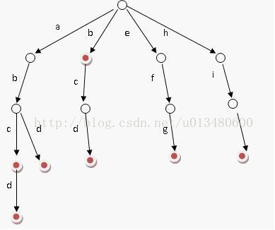

# 字典树

字典树又叫单词查找树(Trie)或前缀树。顾名思义它是与单词的前缀相关的。给你一个单词和一个字典构成的字典树，你可以在O(m)(m为所给单词的长度)时间内判断出该单词是否属于字典。但是如果你用KMP或其他暴力方法，你至少需要把字典中所有单词都遍历一遍。

下图是一个具有单词abc,abcd,b,bcd,efg,hix的字典树。

字典树在判断一个单词是否属于字典时很有优势，但是字典树在判断一个文本包含多少个字典中的单词时就显得不足了，因为对于文本串的每次字符都必须从字典树的跟节点走一遍字典树(很类似于模式串匹配时用的暴力方法)。此时应该用AC自动机